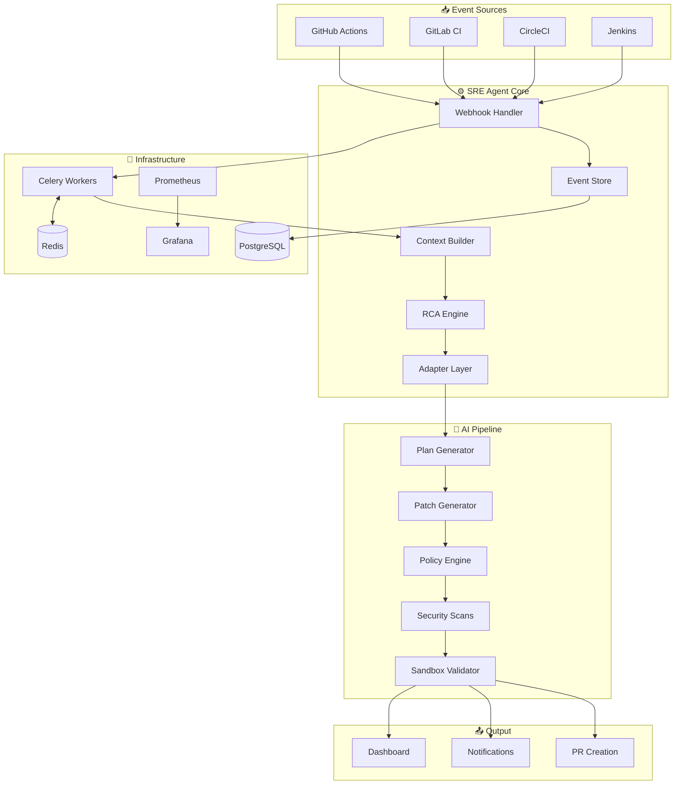

<p align="center">
  
</p>

<p align="center">
  
</p>

<p align="center">
  
  
  
</p>

<p align="center">
  <a href="#-features"></a>
  <a href="#-architecture"></a>
  <a href="#-features"></a>
  <a href="#-features"></a>
</p>

<p align="center">
  
  
  
  
</p>

<br>

<div align="center">

  **🚧 This project is actively under development. Features may change. Contributions welcome!**

</div>

<br>

---

<br>

## 📋 Table of Contents

<details>
<summary>Click to expand</summary>

- [🌟 Overview](#-overview)
- [✨ Key Features](#-key-features)
- [🆕 What's New](#-whats-new)
- [🏗️ Architecture](#️-architecture)
- [🚀 Quick Start](#-quick-start)
- [🔌 API Reference](#-api-reference)
- [⚙️ Configuration](#️-configuration)
- [🧪 Testing](#-testing)
- [📁 Project Structure](#-project-structure)
- [🗺️ Roadmap](#️-roadmap)
- [🤝 Contributing](#-contributing)
- [📄 License](#-license)

</details>

<br>

---

<br>

## 🌟 Overview

<div align="center">

### **No more 3 AM debugging sessions. Let the AI agent fix your builds while you sleep.**

</div>

<br>

The **Autonomous AI-powered SRE Agent** is a cutting-edge platform that revolutionizes how engineering teams handle CI/CD failures. Our intelligent agent transforms the way you manage build failures:

<table>
<tr>
<td width="50%" valign="top">

### 🎯 The Problem

- ⏰ Hours spent debugging CI/CD failures
- 🔄 Repetitive manual fixes for similar issues
- 😴 Late-night on-call pages
- 📉 Developer productivity drain
- 🔍 Root cause analysis is time-consuming

</td>
<td width="50%" valign="top">

### ✅ Our Solution

- 🔍 **Detects** failures in real-time via webhooks
- 🧠 **Diagnoses** root causes with AI
- 🔧 **Generates** safe, context-aware fixes
- ✅ **Validates** in isolated sandboxes
- 🚀 **Creates** detailed Pull Requests

</td>
</tr>
</table>

<br>

---

<br>

## ✨ Key Features

<br>

<table>
<tr>
<td align="center" width="25%">

<br><br>
<b>🎯 Intelligent Detection</b>
<br><br>
Real-time GitHub/GitLab webhooks with multi-runner support (GitHub Actions, CircleCI, Jenkins)
</td>
<td align="center" width="25%">

<br><br>
<b>🧠 AI-Powered RCA</b>
<br><br>
Semantic log analysis with ML models and pattern matching against known failure signatures
</td>
<td align="center" width="25%">

<br><br>
<b>🛠️ Autonomous Fixes</b>
<br><br>
LLM-powered code generation with multi-file support and line-level precision
</td>
<td align="center" width="25%">

<br><br>
<b>🏖️ Sandbox Validation</b>
<br><br>
Isolated Docker environments for safe fix testing with rollback-safe architecture
</td>
</tr>
</table>

<br>

<table>
<tr>
<td align="center" width="25%">

<br><br>
<b>📋 Smart PR Management</b>
<br><br>
Auto-generated PRs with detailed changelogs and confidence scores
</td>
<td align="center" width="25%">

<br><br>
<b>🔐 Enterprise Security</b>
<br><br>
JWT auth, RBAC, session management, and comprehensive audit logging
</td>
<td align="center" width="25%">

<br><br>
<b>📊 Modern Dashboard</b>
<br><br>
React 18 + TypeScript with real-time metrics and dark mode support
</td>
<td align="center" width="25%">

<br><br>
<b>📈 Full Observability</b>
<br><br>
Prometheus, Grafana, OpenTelemetry tracing, and Tempo integration
</td>
</tr>
</table>

<br>

---

<br>

## 🆕 What's New

<br>

<table>
<tr>
<td>

### 🧾 Explainability + Trust Dashboard
**Evidence-based failure analysis with full transparency**

- ✅ Root cause + log evidence with line indices
- ✅ Patch preview (unified diff) + FixPlan JSON preview
- ✅ Danger score breakdown + policy violations surfaced
- ✅ Scan summaries (gitleaks/trivy/sbom + sandbox status)
- ✅ Provenance artifact viewer + pipeline timeline

</td>
<td>

### 📊 Observability Stack
**Complete monitoring and tracing infrastructure**

- ✅ Prometheus metrics at `/metrics`
- ✅ Grafana dashboards + provisioning
- ✅ OpenTelemetry tracing via OTLP
- ✅ Local collector + Tempo integration
- 📖 [Docs: observability.md](docs/observability.md)

</td>
</tr>
<tr>
<td>

### 🖥️ React Dashboard
**Modern, responsive web interface**

- ✅ React 18 + TypeScript + Vite
- ✅ Real-time system overview and metrics
- ✅ Interactive event monitoring
- ✅ Dark mode support
- ✅ Responsive design

</td>
<td>

### 🔐 Authentication & Authorization
**Enterprise-grade security**

- ✅ JWT-based secure authentication
- ✅ User registration and login system
- ✅ Role-based access control (RBAC)
- ✅ Session management with Redis
- ✅ Comprehensive audit logging

</td>
</tr>
<tr>
<td>

### 🔔 Real-time Notifications
**Instant updates when you need them**

- ✅ Server-Sent Events (SSE)
- ✅ In-app notification center
- ✅ Configurable alert preferences
- ✅ Push notification support

</td>
<td>

### 🌍 Multi-Language Support
**Not just Python - works with your stack**

- ✅ Node.js (npm/yarn)
- ✅ Go (go.mod/go.sum)
- ✅ Java (Maven/Gradle)
- ✅ Docker (Dockerfile)
- ✅ Python (pip/poetry)

</td>
</tr>
</table>

<br>

---

<br>

## 🏗️ Architecture

<br>



<br>

### 🔄 Pipeline Flow

```
┌─────────────────────────────────────────────────────────────────────────────────┐
│                           DETERMINISTIC FIX PIPELINE                             │
├─────────────────────────────────────────────────────────────────────────────────┤
│                                                                                  │
│  ┌──────────┐   ┌──────────┐   ┌──────────┐   ┌──────────┐   ┌──────────┐       │
│  │ ADAPTER  │──▶│   PLAN   │──▶│  PATCH   │──▶│   SCAN   │──▶│ VALIDATE │       │
│  │  SELECT  │   │ (LLM→JSON)│  │(Diff Gen)│   │(Security)│   │(Sandbox) │       │
│  └──────────┘   └──────────┘   └──────────┘   └──────────┘   └──────────┘       │
│       │              │              │              │              │              │
│       ▼              ▼              ▼              ▼              ▼              │
│   Language       Fix Plan      Unified       gitleaks       Tests Pass?         │
│   Detection      JSON Only     Diff File     trivy/SBOM     ────────────        │
│                                              Secrets Scan   If YES → PR          │
│                                                             If NO → Alert        │
│                                                                                  │
└─────────────────────────────────────────────────────────────────────────────────┘
```

<br>

### 🛠️ Tech Stack

<table>
<tr>
<th>Layer</th>
<th>Technology</th>
<th>Purpose</th>
</tr>
<tr>
<td><b>🌐 API</b></td>
<td></td>
<td>Async REST API framework</td>
</tr>
<tr>
<td><b>🖥️ Frontend</b></td>
<td>  </td>
<td>Modern reactive UI</td>
</tr>
<tr>
<td><b>⚡ Task Queue</b></td>
<td> </td>
<td>Async task processing</td>
</tr>
<tr>
<td><b>💾 Database</b></td>
<td></td>
<td>Event and run persistence</td>
</tr>
<tr>
<td><b>🧠 AI/LLM</b></td>
<td> </td>
<td>Fix plan generation</td>
</tr>
<tr>
<td><b>🔍 Embeddings</b></td>
<td> </td>
<td>Semantic log analysis</td>
</tr>
<tr>
<td><b>📊 Observability</b></td>
<td>  </td>
<td>Metrics, dashboards, tracing</td>
</tr>
<tr>
<td><b>🐳 Container</b></td>
<td> </td>
<td>Containerization & orchestration</td>
</tr>
</table>

<br>

---

<br>

## 🚀 Quick Start

<br>

### Prerequisites

<table>
<tr>
<td>✅</td>
<td><b>Python 3.11+</b></td>
<td>Core runtime</td>
</tr>
<tr>
<td>✅</td>
<td><b>Docker & Docker Compose</b></td>
<td>Container orchestration</td>
</tr>
<tr>
<td>✅</td>
<td><b>Poetry</b></td>
<td>Python dependency management</td>
</tr>
<tr>
<td>✅</td>
<td><b>Node.js 18+</b></td>
<td>Frontend development</td>
</tr>
<tr>
<td>✅</td>
<td><b>GitHub PAT</b></td>
<td>API access for webhooks</td>
</tr>
</table>

<br>

### 🐳 Option 1: Docker (Recommended)

```bash
# Clone the repository
git clone https://github.com/Mrgig7/Autonomous-Al-powered-SRE-Agent.git
cd Autonomous-Al-powered-SRE-Agent

# Configure environment
cp .env.example .env
# Edit .env with your GitHub token and settings

# Start all services
docker-compose up -d

# Check status
docker-compose ps
```

<br>

### 💻 Option 2: Local Development

```bash
# Clone the repository
git clone https://github.com/Mrgig7/Autonomous-Al-powered-SRE-Agent.git
cd Autonomous-Al-powered-SRE-Agent

# Configure environment
cp .env.example .env

# Start infrastructure
docker-compose up -d postgres redis

# Install Python dependencies
poetry install

# Run database migrations
poetry run alembic upgrade head

# Terminal 1: Start API server
poetry run uvicorn sre_agent.main:app --reload --host 0.0.0.0 --port 8000

# Terminal 2: Start Celery worker
poetry run celery -A sre_agent.celery_app worker --loglevel=info

# Terminal 3: Start frontend
cd frontend && npm ci && npm run dev
```

<br>

### 🌐 Access Points

| Service | URL | Description |
|---------|-----|-------------|
| 🖥️ **Dashboard** | http://localhost:3000 | React frontend |
| 📚 **API Docs** | http://localhost:8000/docs | Swagger UI |
| 📊 **Prometheus** | http://localhost:9090 | Metrics |
| 📈 **Grafana** | http://localhost:3001 | Dashboards |

<br>

---

<br>

## 🔌 API Reference

<br>

### Core Endpoints

<details>
<summary><b>🏥 Health Check</b></summary>

```http
GET /health
```

**Response:**
```json
{
  "status": "healthy",
  "version": "1.0.0",
  "database": "connected",
  "redis": "connected"
}
```
</details>

<details>
<summary><b>📥 Ingest CI/CD Event</b></summary>

```http
POST /api/v1/events/ingest
Content-Type: application/json

{
  "event_type": "workflow_run",
  "repository": "owner/repo",
  "run_id": 12345,
  "status": "failure",
  "logs_url": "https://api.github.com/..."
}
```
</details>

<details>
<summary><b>🔍 Get Failure Analysis</b></summary>

```http
GET /api/v1/failures/{failure_id}/analysis
```

**Response:**
```json
{
  "failure_id": "abc123",
  "root_cause": "Missing runtime dependency: requests",
  "category": "python_missing_dependency",
  "confidence": 0.92,
  "evidence": ["ModuleNotFoundError: No module named 'requests'"]
}
```
</details>

<details>
<summary><b>🔧 Generate Fix</b></summary>

```http
POST /api/v1/failures/{failure_id}/fix
```
</details>

<details>
<summary><b>🧾 Get Explanation (Explainability API)</b></summary>

```http
GET /api/v1/failures/{failure_id}/explain
```

Returns evidence-based failure explanation with:
- Root cause + log evidence with line indices
- Danger score breakdown
- Policy violations
</details>

<details>
<summary><b>📜 Get Provenance Artifact</b></summary>

```http
GET /api/v1/runs/{run_id}/artifact
```

Returns full provenance including:
- Plan JSON, policy decisions
- Scan results (gitleaks, trivy, SBOM)
- Validation results
</details>

<br>

📖 **Full API documentation:** http://localhost:8000/docs

<br>

---

<br>

## ⚙️ Configuration

<br>

### Environment Variables

| Variable | Description | Default |
|----------|-------------|---------|
| `GITHUB_TOKEN` | GitHub Personal Access Token | **Required** |
| `GITHUB_WEBHOOK_SECRET` | Webhook signature secret | **Required** |
| `DATABASE_URL` | PostgreSQL connection | `postgresql+asyncpg://...` |
| `REDIS_URL` | Redis connection | `redis://localhost:6379/0` |
| `LLM_PROVIDER` | LLM provider | `ollama` |
| `OLLAMA_MODEL` | Model for fixes | `deepseek-coder:6.7b` |
| `LOG_LEVEL` | Logging verbosity | `INFO` |

<br>

### 🛡️ Safety Policy

The agent enforces configurable safety policies before applying patches:

```yaml
# config/safety_policy.yaml
paths:
  allowed:
    - "src/**"
    - "tests/**"
  forbidden:
    - ".github/workflows/**"  # Never edit workflows
    
secrets:
  forbidden_patterns:
    - "(?i)api[_-]?key"
    - "(?i)password"
    
patch_limits:
  max_files: 10
  max_lines_added: 500
  max_lines_removed: 200
  
danger:
  safe_max: 25  # Score < 25 = "safe" label
```

<br>

### 🔒 Security Scans

All fixes are validated with supply-chain scanning:

| Scanner | Purpose | Behavior |
|---------|---------|----------|
| **gitleaks** | Secrets detection | Any finding → blocks PR |
| **trivy fs** | Vulnerability scan | Blocks if severity ≥ HIGH |
| **syft** | SBOM generation | Stored for audit |

<br>

---

<br>

## 🧪 Testing

<br>

```bash
# Run all tests
poetry run pytest

# Run with coverage
poetry run pytest --cov=src/sre_agent --cov-report=html

# Run specific tests
poetry run pytest tests/test_api.py -v

# Run offline evaluation harness
python -m evals.run --limit 35 --model mock --out evals/results/run_local
```

<br>

### 📊 Evaluation Metrics

| Model | Cases | Fix Success | Safe Fix Rate | Avg Danger | Avg MTTR |
|-------|------:|------------:|--------------:|-----------:|---------:|
| mock  | 35    | 71.4%       | 71.4%         | 13.0       | 0.00s    |

<br>

---

<br>

## 📁 Project Structure

<br>

```
📦 Autonomous-AI-powered-SRE-Agent
├── 📂 src/sre_agent/           # Main application package
│   ├── 📂 adapters/            # Multi-language adapters (Python, Node, Go, Java, Docker)
│   ├── 📂 ai/                  # AI/LLM integration (plan generation, embeddings)
│   ├── 📂 api/                 # FastAPI routes and endpoints
│   ├── 📂 auth/                # Authentication & RBAC
│   ├── 📂 explainability/      # Evidence-based explanations
│   ├── 📂 fix_pipeline/        # Deterministic fix pipeline
│   ├── 📂 intelligence/        # RCA engine
│   ├── 📂 knowledge/           # Knowledge base & embeddings
│   ├── 📂 models/              # SQLAlchemy database models
│   ├── 📂 notifications/       # SSE & push notifications
│   ├── 📂 observability/       # Metrics & tracing
│   ├── 📂 pr/                  # Pull request creation
│   ├── 📂 safety/              # Policy engine & security
│   ├── 📂 sandbox/             # Sandbox validation engine
│   ├── 📂 schemas/             # Pydantic models
│   ├── 📂 services/            # Business logic
│   └── 📂 tasks/               # Celery async tasks
├── 📂 frontend/                # React 18 + TypeScript dashboard
├── 📂 observability/           # Prometheus, Grafana, Tempo configs
├── 📂 evals/                   # Offline evaluation harness
├── 📂 tests/                   # Test suite
├── 📂 docs/                    # Documentation
├── 📂 alembic/                 # Database migrations
├── 📄 docker-compose.yml       # Container orchestration
├── 📄 Dockerfile               # Container build
└── 📄 pyproject.toml           # Python dependencies
```

<br>

---

<br>

## 🗺️ Roadmap

<br>

### ✅ Completed

- [x] 🏗️ Project foundation & architecture
- [x] 📡 Event ingestion API (GitHub, GitLab)
- [x] 🧠 AI fix generation engine
- [x] 🏖️ Sandbox validation engine
- [x] 📋 PR creation service
- [x] 🌐 React 18 Dashboard
- [x] 🔐 JWT Authentication & RBAC
- [x] 🔔 Real-time Notifications (SSE)
- [x] 📊 Dashboard API & Analytics
- [x] 📝 Audit Logging System
- [x] 🧾 Explainability + Trust Dashboard
- [x] 📈 Observability Stack (Prometheus, Grafana, OTel)
- [x] 🌍 Multi-Language Adapters (Python, Node, Go, Java, Docker)
- [x] 🔒 Security Scans (gitleaks, trivy, SBOM)

<br>

### 🚧 In Progress

- [ ] 🔄 CircleCI & Jenkins integration
- [ ] 📊 Advanced analytics & reporting
- [ ] 🔐 Enhanced security features

<br>

### 🔮 Planned

- [ ] 📱 Mobile-responsive PWA
- [ ] 🤖 AI model fine-tuning
- [ ] 🌐 Multi-region deployment
- [ ] 📊 Custom dashboard widgets
- [ ] 🔗 Slack/Teams integrations

<br>

---

<br>

## 🤝 Contributing

<br>

We welcome contributions! Here's how to get started:

```bash
# 1. Fork the repository

# 2. Create your feature branch
git checkout -b feature/AmazingFeature

# 3. Commit your changes
git commit -m 'Add some AmazingFeature'

# 4. Push to the branch
git push origin feature/AmazingFeature

# 5. Open a Pull Request
```

<br>

### 📏 Code Standards

- ✅ Follow PEP 8 for Python
- ✅ Use TypeScript strict mode for frontend
- ✅ Add tests for new features
- ✅ Update documentation

<br>

---

<br>

## 📄 License

<br>

This project is licensed under the **MIT License** - see the [LICENSE](LICENSE) file for details.

<br>

---

<br>

<p align="center">
  <b>Built with ❤️ for SRE teams everywhere</b>
</p>

<p align="center">
  <a href="https://github.com/Mrgig7/Autonomous-Al-powered-SRE-Agent/issues">🐛 Report Bug</a>
  •
  <a href="https://github.com/Mrgig7/Autonomous-Al-powered-SRE-Agent/issues">💡 Request Feature</a>
  •
  <a href="https://github.com/Mrgig7/Autonomous-Al-powered-SRE-Agent/stargazers">⭐ Star the Repo</a>
</p>

<p align="center">
  
  
  
</p>
